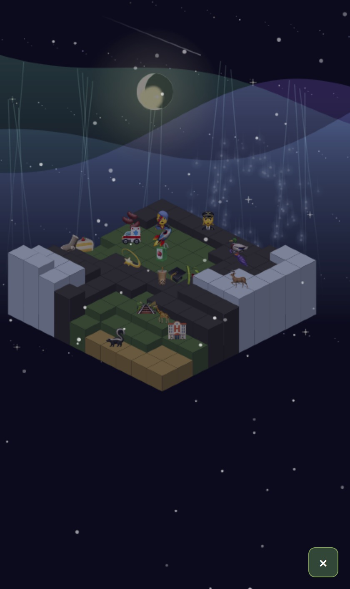

# 🌿 絵文字庭 (emoji-niwa)

🌐 **日本語** | [English](README.md)

<p align="center"></p>

絵文字を置いて自分だけの箱庭をつくる、ブラウザだけで動く箱庭シミュレーター。

地形を生成して、絵文字を並べて、天気と時間を変えて、夜には花火やオーロラを眺める ── インストール不要、依存ゼロの単一 HTML ファイルで完結します。

**🎮 デモ:** https://0x5da3.github.io/emoji-niwa/

## ✨ 特長

- **2D / 3D 表示** — トップダウンの平面ビューと、高さ表現つきアイソメトリック 3D ビューを切り替え
- **絵文字の配置** — 自然・動物・建物・空・食べ物・乗り物・人・季節イベントなど 10 カテゴリ。動物は箱庭の中を歩き回り、夜になると眠り（💤）、夜行性の生き物（🦉🦊🦝🦔🐍🐈‍⬛）は夜に活動します。水生動物（🐟🐠🐡🦞🦀🐢）は水セルから出られず、陸に置かれた場合は最寄りの水セルへ向かいます。約30秒以内に水へ辿り着けないと消えます
- **地形ペイント** — 草・砂・水・雪・岩＋カスタムカラーで塗り、タイルの高さを上げ下げ
- **地形の自動生成** — 5カテゴリ22プリセット（みどり／山・雪／荒野／水辺／人の場所。例: 草原・森・アマゾン・峡谷・メサ・サバンナ・海辺・環礁・城・農村）を Perlin ノイズで生成、単色塗りつぶし、ランダム散布
- **地形に合った絵文字を自動配置** — 生成した地形タイプに合わせて絵文字を自動で散らします（草地→木や花、水→魚・カモ、砂→サボテン、雪→雪だるま・シカ、岩→岩・針葉樹）。既定オン、🎲 生成パネルに ON/OFF と密度スライダーがあります。徘徊する動物は受信側でスポーンセルから動き始めます（共有リンクをまたいで位置はドリフトしません）。岩タイプは「岩」と「都市の道路」が同タイプで曖昧なため、装飾は中立な自然絵文字に留めています。自動配置の絵文字は **共有リンクに列挙されません** — 受信側が同じ種から再生成する仕組みなので、高密度でも URL は ~150 字を維持します
- **時間と空** — 24 時間の時刻スライダー、昼夜で変わる空・太陽・月・星空（時間を止めることも可能）
- **天気** — 晴れ / 雨 / 雪 / 雷雨 / 雹 / 砂嵐 / 桜吹雪 / 紅葉。候補からランダムに切り替えるモードも
- **演出** — 夜：花火・オーロラ／昼：シャボン玉・朝霧。月をタップで流星群、雨の日に太陽をタップで虹
- **効果音** — Web Audio で合成したかわいい配置音 9 種＋花火・シャボン玉の音に加え、地形ペイント／消去／高さ、マップ生成、単色塗り、全リセット、流星群・虹・雷にもフィードバック音。さらに**天気と時刻に追従する自動生成アンビエント BGM**（音声ファイル無しの手続き生成・既定オフ・SFX ミュートとは独立）。🔈 パネルにミュート・音量スライダーと、独立した BGM の ON/OFF＋音量
- **言語切り替え** — 設定メニューから日本語 / English を切り替え（選択は保存されます）
- **保存** — localStorage に自動保存（間隔は設定可能）＋手動セーブ。リロードしても箱庭が残ります
- **GIF・動画書き出し** — 「📸」ボタン（🔈 の下）でまず**撮影される正方形範囲**が画面に表示され（上辺は画面最上部から・範囲外は暗くなります）、表示中は箱庭の移動・ズームで構図を調整でき、OK を押すとその範囲を**画面の見たまま**約3秒・正方形のクリップ（UI は写り込みません）として自前エンコードの GIF に書き出し、**直接ダウンロード**で保存（解像度は📸 撮影フレーム上で 標準320／高720／最大1080 から選択でき、既定は高720、Live Photo 化をより高解像度に）。受け側で静止画に再エンコードされてしまうのを避けるため共有シートは経由せず、保存後にユーザー自身が Files／写真アプリから .gif のまま共有できます。保存後のヒントは端末別で、iOS は Apple ショートカット／対応アプリで Live Photo 化（端末側で実施。ブラウザからは Live Photo を直接作成できません）、Android はライブ壁紙／動く画像アプリで活用、を案内。撮影フレームには対応ブラウザでのみ「🎬 動画を作成」ボタンも表示（WebM・約5秒）— iOS Safari など非対応端末は従来どおり GIF のみ
- **共有リンク** — 左の縦ボタン列の「🔗」で自分のワールドを共有リンク化（静的スナップショット・サーバー不要）。「シェア」か「リンクをコピー」を選べます。開いた人は閲覧モードで、その人の箱庭やオートセーブには干渉しません（「自分の箱庭に戻る」「これを自分のものに」も可能）。下の「マルチプレイ」とは別物で、こちらは一方向のスナップショット（リアルタイム共同編集ではない）。手編集ゼロの生成直後ワールドはレシピ（種＋プリセット＋自動配置密度）のみをエンコード — 自動絵文字はリンクには列挙されず開封側で決定論的に再生成するため、高密度でも URL は ~150 字に収まります。手編集を加えると以降は厳密なスナップショット往復に切り替わります
- **マルチプレイ（任意）** — 「👥」で招待リンクを発行し、友達とリアルタイム共同編集。**発行は GitHub ログイン会員のみ**、参加は招待リンクを開けば誰でも可。参加中は「👥」ボタンに現在人数（例: 2/8）を常時表示、パレット上のチャット（3行・最小化/拡大可）で会話でき、誰かが入室するとチャットに通知。後から参加した人にも直近のチャット履歴（最大約100件・参加時に再生）が表示されます。自分のオフライン箱庭・オートセーブには干渉しません。オーナーは空き部屋の保持日数（1〜30日・既定7）を設定できます。要・別バックエンド（Rust/Actix、`server/` 参照）。未設定ならオフライン/`🔗`共有リンクは従来どおり動作
- **操作補助** — ズーム、ミニマップ、フルスクリーン、配置のやり直し（Undo）、新規マップ（5×5〜50×50）、左の縦ボタン列をワンタップで折りたたみ、⚙️ 設定メニューにバージョン表示とわかりやすい更新履歴
- **アプリ内ヘルプ** — 「📖」ボタンで遊び方パネルを開き、初めての人向けの流れと全操作・全ボタンのクイックリファレンスを表示（日英対応・言語切替に追従）
- **斜めキー** — 斜め4方向（↖↗↙↘）の矢印でアクティブマスをアイソメ grid に沿って移動し、中央の ⚪ で選択中の絵文字を配置（マスのタップ／キーボード q/e/z/c・テンキー 7/9/1/3／長押し連続移動にも対応・⚙️設定でON/OFF）

## 🕹 使い方

| 操作 | 動作 |
|---|---|
| タップ / クリック | 選択中の絵文字を配置（または地形を塗る・消す） |
| ドラッグ / 2 本指 | 視点をパン |
| ＋ / − ボタン | ズームイン / アウト |
| 🗺 ボタン | ミニマップ表示 |
| 2D / 3D トグル | 表示モード切り替え |
| ↩ 戻す | 直前の操作を取り消し |
| 🌙 をタップ | 流星群 |
| ☀️ をタップ（雨天時） | 雨が止んで虹が出る |

左上に ⚙️ 設定・💾 保存・🔈 サウンド、上部バーに時刻・天気・生成・演出の各メニューがあります。

## 🚀 ローカルで動かす

ビルド不要。リポジトリを取得して `index.html` をブラウザで開くだけです。

```bash
git clone https://github.com/0x5da3/emoji-niwa.git
cd emoji-niwa
# そのまま index.html を開く、または簡易サーバで配信
python3 -m http.server 8000   # → http://localhost:8000
```

> iOS Safari で日本語が文字化けする場合は、`charset=utf-8` を付けて配信するか、GitHub Pages の URL（charset 付き）で開いてください。

## 🛠 技術構成

- **フレームワーク / ライブラリ / ビルド: なし** — 単一の `index.html` で完結
- 描画は **Canvas 2D**（アイソメトリック投影・自前 Perlin ノイズによる地形生成）
- 効果音は **Web Audio API** によるリアルタイム合成（音声ファイルなし）
- 状態の永続化は **localStorage**、UI は日英対応（表示テキストのみ翻訳）
- スマホのタッチ操作・ピンチ／2 本指パンに対応

## 📁 構成

```
emoji-niwa/
├── index.html      # アプリ本体（HTML + CSS + JS すべて）
├── server/         # 任意の多人数バックエンド（Rust/Actix・別デプロイ。server/README.md 参照）
├── assets/
│   └── screenshot.jpg  # README で使用する画像
├── README.md       # 英語版
└── README.ja.md    # 日本語版（このファイル）
```

## 🌐 デプロイ（GitHub Pages）

ルート直下の静的 `index.html` のみなので、ビルド不要でそのまま配信できます。

1. リポジトリの **Settings → Pages**
2. **Source**: `Deploy from a branch`
3. **Branch**: `main` / `/ (root)` → **Save**

数分後に `https://0x5da3.github.io/emoji-niwa/` で公開され、以降は `main` への push で自動更新されます。
